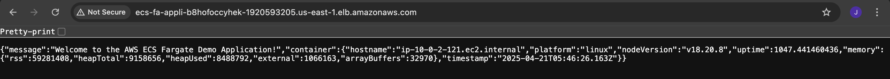
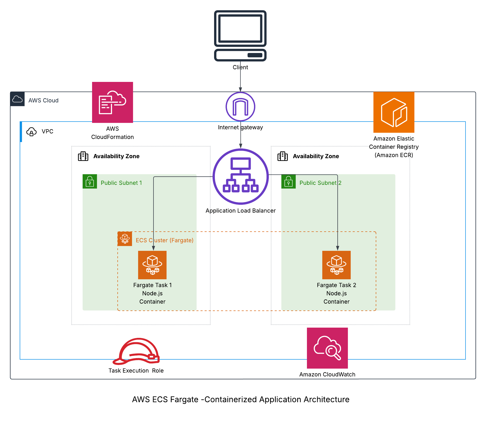

# 🐳 Containerized Application on AWS ECS Fargate


🔗 **Live Demo:** [http://ecs-fa-Appli-B8HoFoccYhek-1920593205.us-east-1.elb.amazonaws.com](http://ecs-fa-Appli-B8HoFoccYhek-1920593205.us-east-1.elb.amazonaws.com)

## 📋 Project Overview

This project demonstrates deploying a containerized Node.js application to AWS using ECS (Elastic Container Service) with the Fargate launch type. The application is load-balanced, auto-scaled, and runs in a fully managed serverless environment without the need to provision or manage EC2 instances.

The system uses an Application Load Balancer for traffic distribution, and the entire infrastructure is defined and deployed using AWS CloudFormation, following Infrastructure as Code best practices.

---

## ✅ Key Features & Services

- 🐳 **Docker** - Application containerization
- 🌐 **Amazon ECR** - Container registry for storing Docker images
- 🚢 **Amazon ECS** - Container orchestration service
- 🧙‍♂️ **AWS Fargate** - Serverless compute for containers
- ⚖️ **Application Load Balancer** - Traffic distribution and health checks
- 🏗️ **CloudFormation** - Infrastructure as Code for AWS resources
- 🔒 **IAM Roles** - Secure access control
- 📊 **CloudWatch Logs** - Container logging and monitoring

---

## 🖥️ Application in Action



The screenshot above shows the application successfully deployed and running on AWS ECS Fargate. The JSON response demonstrates:
- The application is running on a Linux container
- Node.js version information
- Container hostname
- Memory usage statistics
- Timestamp showing when the request was processed

---

## 🗺️ Architecture Overview



The architecture follows serverless container hosting best practices, using Fargate to eliminate the need to provision and manage servers while maintaining the benefits of containerization.

---

## 📁 Project Structure

```
aws-ecs-fargate-application/
├── app/                          # Application code
│   ├── app.js                    # Node.js Express application
│   ├── package.json              # Node.js dependencies
│   └── Dockerfile                # Container definition
├── cloudformation/               # Infrastructure as Code
│   └── fargate-infrastructure.yaml # CloudFormation template
├── architecture/                 # Architecture diagrams
│   ├── aws-ecs-fargate-architecture.png  # Architecture diagram
│   └── application-screenshot.png        # Screenshot of running application
├── docs/                         # Additional documentation
│   └── logical-flow.md           # Detailed logical flow explanation
└── README.md                     # Project documentation
```

---

## 🧪 Application Features

The demo application exposes two HTTP endpoints:

- `GET /` - Returns JSON with container metadata including:
  - Hostname
  - Platform
  - Node.js version
  - Container uptime
  - Memory usage
  - Current timestamp

- `GET /health` - Health check endpoint for the load balancer

This allows for visualization of container information and demonstrates proper health check implementation for AWS ECS.

---

## 🚀 Deployment Process

### Prerequisites
- AWS CLI configured with appropriate permissions
- Docker installed locally
- Node.js and npm (for local testing)

### Steps

1. **Build and Push Docker Image to ECR**
   ```bash
   # Create ECR repository
   aws ecr create-repository --repository-name fargate-demo-app

   # Build Docker image with platform specification
   docker build --platform linux/amd64 -t fargate-demo-app app/

   # Tag and push to ECR
   aws ecr get-login-password | docker login --username AWS --password-stdin ACCOUNT_ID.dkr.ecr.REGION.amazonaws.com
   docker tag fargate-demo-app:latest ACCOUNT_ID.dkr.ecr.REGION.amazonaws.com/fargate-demo-app:latest
   docker push ACCOUNT_ID.dkr.ecr.REGION.amazonaws.com/fargate-demo-app:latest
   ```

2. **Deploy Infrastructure with CloudFormation**
   ```bash
   aws cloudformation create-stack \
     --stack-name ecs-fargate-demo \
     --template-body file://cloudformation/fargate-infrastructure.yaml \
     --capabilities CAPABILITY_IAM
   ```

3. **Verify Deployment**
   ```bash
   aws cloudformation describe-stacks --stack-name ecs-fargate-demo --query "Stacks[0].Outputs[?OutputKey=='LoadBalancerDNS'].OutputValue" --output text
   ```

---

## 🧠 Skills Demonstrated

- Containerization with Docker
- AWS ECS and Fargate configuration
- Infrastructure as Code with CloudFormation
- Load balancer setup and health checks
- Container security and IAM roles
- Serverless architecture design
- Multi-platform container builds (ARM64/AMD64)
- Container registry management
- VPC networking and security groups

---

## 📝 Lessons Learned

- **Platform Considerations**: When building Docker images on M1/M2 Macs, platform specification (`--platform linux/amd64`) is crucial for compatibility with AWS Fargate, which runs containers on x86_64 architecture.
- **Container Health Checks**: Implementing a dedicated health check endpoint is essential for reliable container orchestration.
- **Security Group Configuration**: Proper inbound/outbound rules are critical for application accessibility.
- **IAM Role Scope**: Using the principle of least privilege for container task execution roles enhances security.

---

## 📚 Additional Resources

- [AWS Fargate Documentation](https://docs.aws.amazon.com/AmazonECS/latest/developerguide/AWS_Fargate.html)
- [Docker Multi-platform Images](https://docs.docker.com/build/building/multi-platform/)
- [ECS Task Definitions](https://docs.aws.amazon.com/AmazonECS/latest/developerguide/task_definitions.html)

---

## 🔗 Related Projects

- [Static Website on AWS S3](https://github.com/jimmyperalta-dev/aws-ec2-s3-route53-webapp)
- [Serverless API with AWS Lambda & DynamoDB](https://github.com/jimmyperalta-dev/aws-serverless-dynamodb-api)
- [EC2 Monitoring Dashboard](https://github.com/jimmyperalta-dev/aws-ec2-monitoring-dashboard)

---

## 👤 Author

**Jimmy Peralta**  
🛠️ Systems Support Engineer | ☁️ AWS Cloud Enthusiast  
🌐 [https://www.deployjimmy.com](https://www.deployjimmy.com)